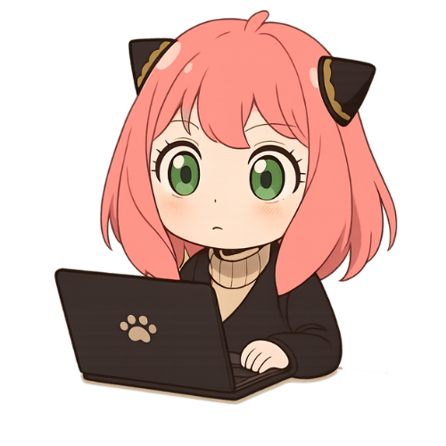

## Hi there 👋

<table>
  <tr>
    <td valign="top" width="60%">
      <h3>🍀 About Me</h3>
      <ul>
        <li>🔭 I’m currently working on personal fun projects.</li>
        <li>🌱 I’m learning GitHub, Web, and Anime-based UI designs.</li>
        <li>💬 Ask me about anything related to Anime tech themes.</li>
        <li>⚡ Fun fact: I code better when my laptop has cat ears 😺.</li>
      </ul>
    </td>
    <td width="40%">
      
    </td>
  </tr>
</table>

### 📊 GitHub Stats

  

  

  

---

### 🔗 Links

- 🌐 [My Website](https://its-anya.github.io/)
- 📫 [My Website](#)

---

  

<!--
**its-anya/its-anya** is a ✨ _special_ ✨ repository because its `README.md` (this file) appears on your GitHub profile.

Here are some ideas to get you started:
<h1 align="center">Hi there! 👋</h1>
- 🔭 I’m currently working on ...
- 🌱 I’m currently learning ...
- 👯 I’m looking to collaborate on ...
- 🤔 I’m looking for help with ...
- 💬 Ask me about ...
- 📫 How to reach me: ...
- 😄 Pronouns: ...
- ⚡ Fun fact: ...

  

---

### 👩‍💻 About Me

- 🔭 I’m currently working on personal fun projects.
- 🌱 I’m learning GitHub, Web, and Anime-based UI designs.
- 💬 Ask me about anything related to Anime tech themes.
- ⚡ Fun fact: I code better when my laptop has cat ears 😺.

---
-->
